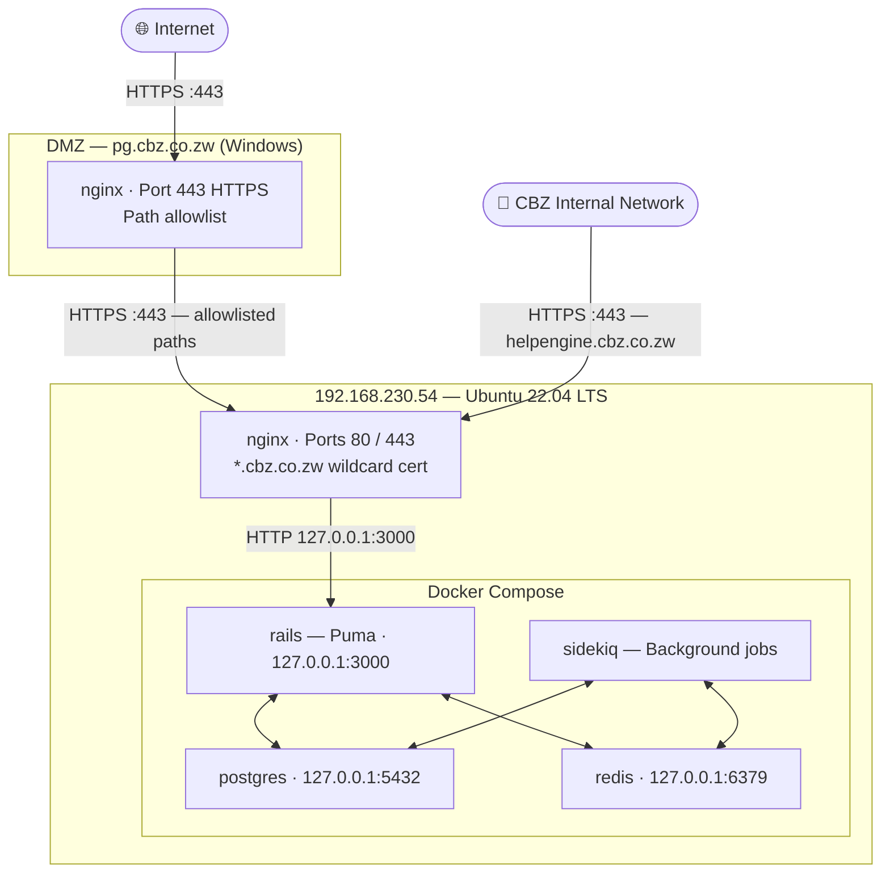

<p align="center">
  
</p>

<h1 align="center">CBZ HelpEngine</h1>
<p align="center"><strong>Deployment Guide</strong></p>
<p align="center">Internal &nbsp;·&nbsp; DevOps &nbsp;·&nbsp; CBZ IT Department</p>

---

# CBZ HelpEngine — Deployment Guide

## Architecture Overview



> Full architecture detail: [docs/ARCHITECTURE.md](docs/ARCHITECTURE.md)

| Machine | OS | CPU | Role |
|---|---|---|---|
| Dev Mac | macOS | Apple Silicon (arm64) | Build & development |
| Production server | Ubuntu 22.04.5 LTS | x86_64 (amd64) | Runs the app |
| DMZ proxy | Windows Server | x86_64 | Internet-facing nginx reverse proxy |

### Why builds must happen on the production server

The Dockerfile uses Alpine Linux (musl libc). Native gems like `grpc` must compile
from source — pre-built binary gems won't run on musl. Cross-compiling under QEMU
emulation (arm64 Mac → amd64) exhausts Docker Desktop memory and fails. Building
directly on the amd64 server avoids emulation entirely.

---

## Prerequisites

### Dev Mac
- Docker Desktop
- `rsync` and `scp` (built into macOS)
- `openssl` (built into macOS — needed to extract certs from PFX)

### Production server
- Docker Engine + Docker Compose v2 (`docker compose` not `docker-compose`)
- nginx (`sudo apt install -y nginx`)
- SSH access (`itdevtd@192.168.230.54`)
- ~15 GB free disk space for the build

---

## First-time deployment

### 1. Prepare the environment file

Copy `.env.production` to the server:

```bash
scp .env.production itdevtd@192.168.230.54:~/cbz-helpengine/.env
```

Key values to review/update:

| Variable | Notes |
|---|---|
| `FRONTEND_URL` | Must be the public URL users access the app from (`https://pg.cbz.co.zw`) |
| `POSTGRES_PASSWORD` | Strong random password |
| `REDIS_PASSWORD` | Strong random password |
| `SECRET_KEY_BASE` | 128-char hex string — generate with `openssl rand -hex 64` |
| `SMTP_*` | CBZ mail relay settings |
| `ACTIVE_RECORD_ENCRYPTION_*` | Generate after first boot (see step 6) |

### 2. Copy the compose file

```bash
scp docker-compose.production.yaml itdevtd@192.168.230.54:~/cbz-helpengine/
```

### 3. Build the image on the server

Sync source code (~1 minute over LAN):

```bash
cd "/path/to/chatwoot"
rsync -az --delete --exclude='node_modules' --exclude='tmp' --exclude='log' \
  . itdevtd@192.168.230.54:~/cbz-source/
```

SSH in and build:

```bash
ssh itdevtd@192.168.230.54
cd ~/cbz-source
docker build -f docker/Dockerfile -t cbz-helpengine:latest . 2>&1 | tee ~/cbz-build.log
```

Build time: ~25–35 minutes (gRPC compilation is the long step).

> **If the build fails with `Permission denied` on `apk update`** — transient Alpine
> CDN issue. Re-run the build command; it picks up cached layers and skips completed steps.

### 4. Start the stack

```bash
cd ~/cbz-helpengine
docker compose -f docker-compose.production.yaml up -d
```

Wait ~20 seconds, then run the database setup (first deploy only):

```bash
docker compose -f docker-compose.production.yaml exec rails bundle exec rails db:chatwoot_prepare
```

### 5. Generate Active Record Encryption keys (first deploy only)

```bash
docker compose -f docker-compose.production.yaml exec rails bundle exec rails db:encryption:init
```

Copy the three printed values into `~/cbz-helpengine/.env`:

```bash
cat >> ~/cbz-helpengine/.env << 'EOF'

ACTIVE_RECORD_ENCRYPTION_PRIMARY_KEY=<value>
ACTIVE_RECORD_ENCRYPTION_DETERMINISTIC_KEY=<value>
ACTIVE_RECORD_ENCRYPTION_KEY_DERIVATION_SALT=<value>
EOF
```

Also update `.env.production` in this repo (keep them in sync), then restart:

```bash
docker compose -f docker-compose.production.yaml restart rails sidekiq
```

### 6. Complete onboarding

Open `http://192.168.230.54:3000` temporarily (before nginx is set up) and follow
the setup wizard to create the first super admin account.

---

## nginx setup (production server)

nginx sits in front of Puma and handles SSL termination, gzip, and request buffering.
Rails is bound to `127.0.0.1:3000` and is not directly network-accessible.

### Install nginx

```bash
sudo apt install -y nginx
```

### Install the wildcard SSL certificate

The cert is stored as a PFX file. Extract it on your Mac first:

```bash
# Password is in passcert.txt inside the cert folder
openssl pkcs12 -in wildcard_internal.pfx -clcerts -nokeys -out cbz.co.zw.crt \
  -passin pass:<password>
openssl pkcs12 -in wildcard_internal.pfx -nocerts -nodes -out cbz.co.zw.key \
  -passin pass:<password>

# Verify
openssl x509 -in cbz.co.zw.crt -noout -subject -dates
```

Copy to the server:

```bash
scp cbz.co.zw.crt cbz.co.zw.key itdevtd@192.168.230.54:~/
```

On the server, move into place:

```bash
sudo mkdir -p /etc/nginx/ssl
sudo mv ~/cbz.co.zw.crt /etc/nginx/ssl/
sudo mv ~/cbz.co.zw.key /etc/nginx/ssl/
sudo chmod 644 /etc/nginx/ssl/cbz.co.zw.crt
sudo chmod 600 /etc/nginx/ssl/cbz.co.zw.key
sudo chown root:root /etc/nginx/ssl/cbz.co.zw.*
```

### nginx site config

Create `/etc/nginx/sites-available/cbz-helpengine`:

```nginx
# HTTP → HTTPS redirect
server {
    listen 80;
    server_name _;
    return 301 https://$host$request_uri;
}

# Main HTTPS server
server {
    listen 443 ssl http2;
    server_name _;

    ssl_certificate     /etc/nginx/ssl/cbz.co.zw.crt;
    ssl_certificate_key /etc/nginx/ssl/cbz.co.zw.key;
    ssl_protocols       TLSv1.2 TLSv1.3;
    ssl_ciphers         HIGH:!aNULL:!MD5;
    ssl_session_cache   shared:SSL:10m;
    ssl_session_timeout 10m;
    ssl_prefer_server_ciphers on;

    gzip on;
    gzip_vary on;
    gzip_min_length 1024;
    gzip_types text/plain text/css application/json application/javascript
               text/xml application/xml image/svg+xml font/woff2;

    # ActionCable WebSocket — must come before location /
    location /cable {
        proxy_pass          http://127.0.0.1:3000;
        proxy_http_version  1.1;
        proxy_set_header    Upgrade $http_upgrade;
        proxy_set_header    Connection "Upgrade";
        proxy_set_header    Host $host;
        proxy_set_header    X-Real-IP $remote_addr;
        proxy_set_header    X-Forwarded-For $proxy_add_x_forwarded_for;
        proxy_set_header    X-Forwarded-Proto $scheme;
        proxy_read_timeout  3600s;
        proxy_send_timeout  3600s;
    }

    # Everything else
    location / {
        proxy_pass          http://127.0.0.1:3000;
        proxy_http_version  1.1;
        proxy_set_header    Host $host;
        proxy_set_header    X-Real-IP $remote_addr;
        proxy_set_header    X-Forwarded-For $proxy_add_x_forwarded_for;
        proxy_set_header    X-Forwarded-Proto $scheme;
        proxy_read_timeout  120s;
        proxy_send_timeout  120s;
        proxy_buffer_size   128k;
        proxy_buffers       4 256k;
    }
}
```

Enable and start:

```bash
sudo ln -s /etc/nginx/sites-available/cbz-helpengine /etc/nginx/sites-enabled/
sudo rm -f /etc/nginx/sites-enabled/default
sudo nginx -t && sudo systemctl enable nginx && sudo systemctl start nginx
```

---

## DMZ nginx configuration (pg.cbz.co.zw)

The DMZ nginx runs on Windows and is internet-facing. It proxies specific paths to
the production server's local nginx over HTTPS. Only the paths listed below are
exposed to the internet — all others are blocked.

Add these location blocks inside the `pg.cbz.co.zw` server block. The `proxy_ssl_verify`
directive is already set at the server block level so it is not repeated per location.

```nginx
# ── CBZ HelpEngine ──────────────────────────────────────────

location /cable {
    proxy_pass         https://192.168.230.54;
    proxy_http_version 1.1;
    proxy_set_header   Upgrade $http_upgrade;
    proxy_set_header   Connection "Upgrade";
    proxy_set_header   Host $host;
    proxy_set_header   X-Real-IP $remote_addr;
    proxy_set_header   X-Forwarded-For $proxy_add_x_forwarded_for;
    proxy_set_header   X-Forwarded-Proto $scheme;
    proxy_read_timeout 3600s;
    proxy_send_timeout 3600s;
}

location /app {
    proxy_pass         https://192.168.230.54;
    proxy_http_version 1.1;
    proxy_set_header   Host $host;
    proxy_set_header   X-Real-IP $remote_addr;
    proxy_set_header   X-Forwarded-For $proxy_add_x_forwarded_for;
    proxy_set_header   X-Forwarded-Proto $scheme;
}

location /auth {
    proxy_pass         https://192.168.230.54;
    proxy_http_version 1.1;
    proxy_set_header   Host $host;
    proxy_set_header   X-Real-IP $remote_addr;
    proxy_set_header   X-Forwarded-For $proxy_add_x_forwarded_for;
    proxy_set_header   X-Forwarded-Proto $scheme;
}

location /api {
    proxy_pass         https://192.168.230.54;
    proxy_http_version 1.1;
    proxy_set_header   Host $host;
    proxy_set_header   X-Real-IP $remote_addr;
    proxy_set_header   X-Forwarded-For $proxy_add_x_forwarded_for;
    proxy_set_header   X-Forwarded-Proto $scheme;
}

location /enterprise {
    proxy_pass         https://192.168.230.54;
    proxy_http_version 1.1;
    proxy_set_header   Host $host;
    proxy_set_header   X-Real-IP $remote_addr;
    proxy_set_header   X-Forwarded-For $proxy_add_x_forwarded_for;
    proxy_set_header   X-Forwarded-Proto $scheme;
}

location /webhooks/whatsapp {
    proxy_pass         https://192.168.230.54;
    proxy_http_version 1.1;
    proxy_set_header   Host $host;
    proxy_set_header   X-Real-IP $remote_addr;
    proxy_set_header   X-Forwarded-For $proxy_add_x_forwarded_for;
    proxy_set_header   X-Forwarded-Proto $scheme;
}

location /bot {
    proxy_pass         https://192.168.230.54;
    proxy_http_version 1.1;
    proxy_set_header   Host $host;
    proxy_set_header   X-Real-IP $remote_addr;
    proxy_set_header   X-Forwarded-For $proxy_add_x_forwarded_for;
    proxy_set_header   X-Forwarded-Proto $scheme;
}

location /rails/active_storage {
    proxy_pass         https://192.168.230.54;
    proxy_http_version 1.1;
    proxy_set_header   Host $host;
    proxy_set_header   X-Real-IP $remote_addr;
    proxy_set_header   X-Forwarded-For $proxy_add_x_forwarded_for;
    proxy_set_header   X-Forwarded-Proto $scheme;
}

location /widget {
    proxy_pass         https://192.168.230.54;
    proxy_http_version 1.1;
    proxy_set_header   Host $host;
    proxy_set_header   X-Real-IP $remote_addr;
    proxy_set_header   X-Forwarded-For $proxy_add_x_forwarded_for;
    proxy_set_header   X-Forwarded-Proto $scheme;
}

location /survey {
    proxy_pass         https://192.168.230.54;
    proxy_http_version 1.1;
    proxy_set_header   Host $host;
    proxy_set_header   X-Real-IP $remote_addr;
    proxy_set_header   X-Forwarded-For $proxy_add_x_forwarded_for;
    proxy_set_header   X-Forwarded-Proto $scheme;
}

location /.well-known {
    proxy_pass         https://192.168.230.54;
    proxy_http_version 1.1;
    proxy_set_header   Host $host;
    proxy_set_header   X-Real-IP $remote_addr;
    proxy_set_header   X-Forwarded-For $proxy_add_x_forwarded_for;
    proxy_set_header   X-Forwarded-Proto $scheme;
}

location /vite {
    proxy_pass         https://192.168.230.54;
    proxy_http_version 1.1;
    proxy_set_header   Host $host;
    proxy_set_header   X-Real-IP $remote_addr;
    proxy_set_header   X-Forwarded-For $proxy_add_x_forwarded_for;
    proxy_set_header   X-Forwarded-Proto $scheme;
    expires            1y;
    add_header         Cache-Control "public, immutable";
}

location ~* ^/(manifest\.json|sw\.js|favicon.*|apple.*|android.*|ms-icon.*|browserconfig\.xml|robots\.txt)$ {
    proxy_pass         https://192.168.230.54;
    proxy_http_version 1.1;
    proxy_set_header   Host $host;
    proxy_set_header   X-Real-IP $remote_addr;
    proxy_set_header   X-Forwarded-For $proxy_add_x_forwarded_for;
    proxy_set_header   X-Forwarded-Proto $scheme;
    expires            7d;
    add_header         Cache-Control "public";
}

location /brand-assets {
    proxy_pass         https://192.168.230.54;
    proxy_http_version 1.1;
    proxy_set_header   Host $host;
    proxy_set_header   X-Real-IP $remote_addr;
    proxy_set_header   X-Forwarded-For $proxy_add_x_forwarded_for;
    proxy_set_header   X-Forwarded-Proto $scheme;
    expires            7d;
    add_header         Cache-Control "public";
}

location /dashboard {
    proxy_pass         https://192.168.230.54;
    proxy_http_version 1.1;
    proxy_set_header   Host $host;
    proxy_set_header   X-Real-IP $remote_addr;
    proxy_set_header   X-Forwarded-For $proxy_add_x_forwarded_for;
    proxy_set_header   X-Forwarded-Proto $scheme;
    expires            7d;
    add_header         Cache-Control "public";
}

location /integrations {
    proxy_pass         https://192.168.230.54;
    proxy_http_version 1.1;
    proxy_set_header   Host $host;
    proxy_set_header   X-Real-IP $remote_addr;
    proxy_set_header   X-Forwarded-For $proxy_add_x_forwarded_for;
    proxy_set_header   X-Forwarded-Proto $scheme;
    expires            7d;
    add_header         Cache-Control "public";
}

location /health {
    proxy_pass         https://192.168.230.54;
    proxy_http_version 1.1;
    proxy_set_header   Host $host;
}

# UserConnect SSO initiation
location /uc {
    proxy_pass         https://192.168.230.54;
    proxy_http_version 1.1;
    proxy_set_header   Host $host;
    proxy_set_header   X-Real-IP $remote_addr;
    proxy_set_header   X-Forwarded-For $proxy_add_x_forwarded_for;
    proxy_set_header   X-Forwarded-Proto $scheme;
}

# UserConnect SAML callback (Microsoft Entra redirects here after auth)
location /saml-callback {
    proxy_pass         https://192.168.230.54;
    proxy_http_version 1.1;
    proxy_set_header   Host $host;
    proxy_set_header   X-Real-IP $remote_addr;
    proxy_set_header   X-Forwarded-For $proxy_add_x_forwarded_for;
    proxy_set_header   X-Forwarded-Proto $scheme;
}

# Notification sounds
location /audio {
    proxy_pass         https://192.168.230.54;
    proxy_http_version 1.1;
    proxy_set_header   Host $host;
    proxy_set_header   X-Real-IP $remote_addr;
    proxy_set_header   X-Forwarded-For $proxy_add_x_forwarded_for;
    proxy_set_header   X-Forwarded-Proto $scheme;
    expires            7d;
    add_header         Cache-Control "public";
}
```

After editing the DMZ nginx config:

```
nginx -t
nginx -s reload
```

---

## Branding

CBZ branding defaults are baked into `config/installation_config.yml` and seed the
database automatically on `db:chatwoot_prepare`. No manual steps needed on a fresh deploy.

If branding is ever lost (e.g. after a database wipe), restore it with:

```bash
cd ~/cbz-helpengine
docker compose -f docker-compose.production.yaml exec rails bundle exec rails runner "
  {
    'INSTALLATION_NAME' => 'CBZ HelpEngine',
    'BRAND_NAME'        => 'CBZ HelpEngine',
    'LOGO'              => '/brand-assets/cbz-logo.png',
    'LOGO_DARK'         => '/brand-assets/cbz-logo.png',
    'LOGO_THUMBNAIL'    => '/brand-assets/cbz-logo.png',
    'BRAND_URL'         => 'https://www.cbz.co.zw',
    'WIDGET_BRAND_URL'  => 'https://www.cbz.co.zw',
  }.each do |name, value|
    InstallationConfig.find_or_initialize_by(name: name).tap { |c| c.value = value; c.save! }
  end
  puts 'Done.'
"
```

---

## WhatsApp inbox setup

1. Create a WhatsApp inbox in Settings → Inboxes → Add Inbox → WhatsApp Cloud
2. Enter the phone number, WhatsApp Business Account ID, API token, and verify token
3. The webhook URL shown will be `https://pg.cbz.co.zw/webhooks/whatsapp/+263...`
4. Paste that URL into the Meta developer console → WhatsApp → Configuration → Webhook
5. In the Chatwoot inbox → Account Health tab → click **Register Webhook**

**Access token expiry:** Temporary Meta tokens expire in ~24 hours. Generate a
permanent system user token via Meta Business Suite → Settings → System Users.

---

## Subsequent deployments (updates)

A `deploy.sh` script in the repository root handles the full deploy in one command from your Mac:

```bash
cd "/path/to/chatwoot"
./deploy.sh
```

The script:
1. `rsync --delete` — mirrors source to `~/cbz-source/` on the server (including deletions/renames)
2. Builds the Docker image on the server with BuildKit cache mounts (subsequent builds are faster)
3. Recreates the `rails` and `sidekiq` containers from the new image
4. Waits 25 seconds then tails recent logs to confirm Puma started

> To pick up changes to `.env`, you still need to manually restart with `up -d` after editing the file — `deploy.sh` only restarts containers using `--force-recreate` against the current `.env`.

---

## Useful commands

```bash
# View live logs
docker compose -f docker-compose.production.yaml logs -f rails

# Check container status
docker compose -f docker-compose.production.yaml ps

# Open a Rails console
docker compose -f docker-compose.production.yaml exec rails bundle exec rails console

# Stop everything
docker compose -f docker-compose.production.yaml down

# Stop and wipe database volumes (DESTRUCTIVE — loses all data)
docker compose -f docker-compose.production.yaml down -v
```

---

## File locations

### Production server (`192.168.230.54`)

| Path | Purpose |
|---|---|
| `~/cbz-helpengine/.env` | Production environment variables (not in repo — back up separately) |
| `~/cbz-helpengine/docker-compose.production.yaml` | Compose stack definition |
| `~/cbz-source/` | Source code used for builds |
| `~/cbz-build.log` | Log from the last Docker build |
| `/etc/nginx/sites-available/cbz-helpengine` | nginx site config |
| `/etc/nginx/ssl/cbz.co.zw.crt` | Wildcard SSL certificate (expires Mar 15 2028) |
| `/etc/nginx/ssl/cbz.co.zw.key` | Wildcard SSL private key |

### DMZ proxy (`pg.cbz.co.zw`)

| Path | Purpose |
|---|---|
| `C:\nginx\conf\nginx.conf` | Main nginx config containing the HelpEngine location blocks |

---

## Internal access (on CBZ network)

For internal users to access the app with a clean SSL padlock:

1. Ask IT/DNS to create: `helpengine.cbz.co.zw → 192.168.230.54`
2. Install the CBZ internal root CA on client machines (see the PDF in the cert folder)
3. Access the app at `https://helpengine.cbz.co.zw`

Without the DNS entry, internal users must use `https://192.168.230.54` directly,
which triggers a certificate warning (the wildcard cert covers hostnames, not bare IPs).
