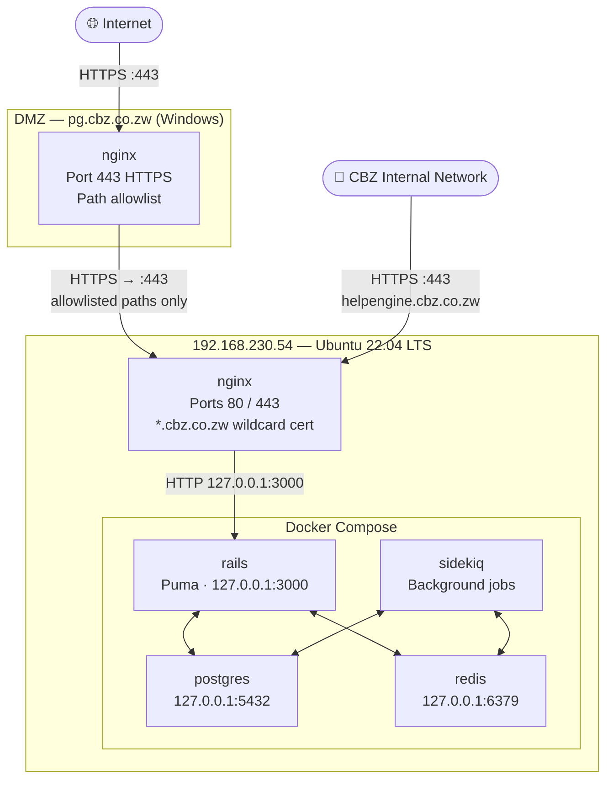
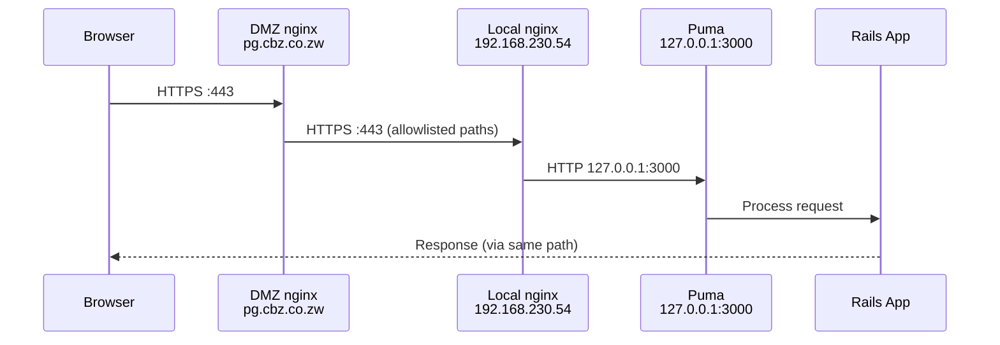
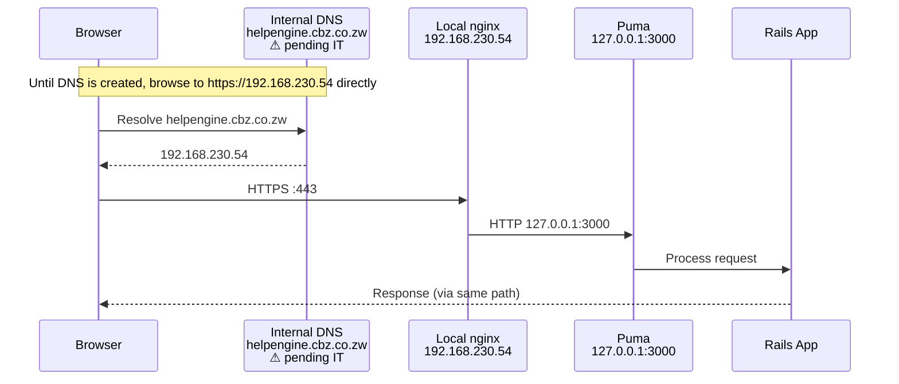
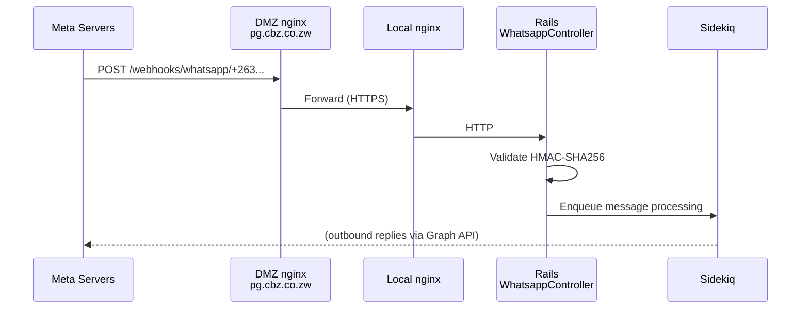
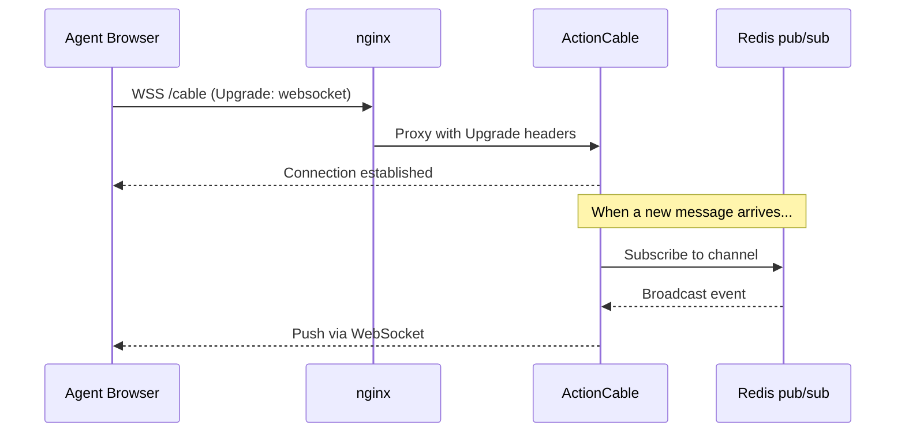
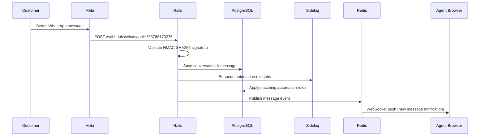

# CBZ HelpEngine — System Architecture

## Overview

CBZ HelpEngine is a customised deployment of the Chatwoot open-source customer support
platform, rebranded and configured for CBZ Bank Limited's internal support operations.
It provides a unified inbox for managing customer conversations across multiple channels
including WhatsApp, email, and web chat.

---

## Network Topology

> **⚠ DNS pending** — The internal DNS entry for `helpengine.cbz.co.zw` has not been
> created yet (pending IT). Internal users must access the application directly via IP
> until the DNS record is in place:
>
> - **HTTPS (recommended):** `https://192.168.230.54` — requires the CBZ root CA to be
>   installed on the client machine to avoid the certificate warning
> - **External URL (workaround):** `https://pg.cbz.co.zw` — works from inside the
>   network but routes via the DMZ
>
> Once IT creates the `helpengine.cbz.co.zw → 192.168.230.54` A record, the direct
> internal URL will work cleanly with no cert warning for machines that have the root CA installed.

---

## Request Flows

### External user (internet)

### Internal user (CBZ network)

> **Currently:** DNS entry pending — internal users must use `https://192.168.230.54` directly.
> Once `helpengine.cbz.co.zw` is registered in DNS, the flow below will apply.

### WhatsApp webhook (Meta → app)

### Real-time updates (WebSocket)

---

## Components

### Rails application (Puma)

The core application server. Handles all HTTP requests, business logic, API endpoints,
and ActionCable WebSocket connections. Bound exclusively to `127.0.0.1:3000` — not
directly reachable from the network.

### Sidekiq

Background job processor. Handles:
- Outbound WhatsApp messages
- Email delivery (SMTP)
- Webhook event processing
- Report generation
- Scheduled jobs (via sidekiq-cron)

Shares the same Docker image as the Rails container but runs with a different entrypoint.

### PostgreSQL (pgvector/pgvector:pg16)

Primary database. Uses the `pgvector` extension for AI/semantic search features.
Database name: `cbz_helpengine`. Bound to `127.0.0.1:5432` — not network-accessible.

### Redis

Used for:
- ActionCable pub/sub (real-time WebSocket broadcasts)
- Sidekiq job queues
- Session caching

Bound to `127.0.0.1:6379` — not network-accessible. Password-protected.

### nginx (local — 192.168.230.54)

- Terminates TLS using the `*.cbz.co.zw` wildcard certificate
- Redirects HTTP → HTTPS
- Proxies all traffic to Puma on `127.0.0.1:3000`
- Handles WebSocket upgrade headers for `/cable`
- Provides gzip compression and request buffering

### nginx (DMZ — pg.cbz.co.zw)

- Internet-facing reverse proxy running on Windows
- Exposes only specific application paths (allowlist approach)
- Proxies to the local nginx over HTTPS
- Provides the public entry point for Meta webhook callbacks

---

## Port Map

| Service | Bound to | Port | Accessible from |
|---|---|---|---|
| nginx HTTP | 0.0.0.0 | 80 | LAN (redirects to 443) |
| nginx HTTPS | 0.0.0.0 | 443 | LAN + DMZ |
| Puma (Rails) | 127.0.0.1 | 3000 | localhost only |
| PostgreSQL | 127.0.0.1 | 5432 | localhost only |
| Redis | 127.0.0.1 | 6379 | localhost only |

---

## Data Flow — Inbound WhatsApp message

---

## Paths Exposed Through DMZ

The DMZ nginx uses an allowlist — only these paths are proxied to the application.
All other requests return the DMZ's default response.

| Path | Purpose |
|---|---|
| `/app` | Main dashboard UI |
| `/auth` | Login, password reset, OAuth |
| `/api` | REST API |
| `/public` | Public API (CSAT survey submission, widget API) |
| `/enterprise` | Enterprise feature API |
| `/cable` | ActionCable WebSocket |
| `/webhooks/whatsapp` | WhatsApp webhook callbacks |
| `/bot` | Facebook Messenger webhook |
| `/widget` | Embeddable chat widget |
| `/survey` | CSAT survey links |
| `/rails/active_storage` | File/attachment serving |
| `/vite` | Compiled JS/CSS assets |
| `/brand-assets` | Logo and brand images |
| `/dashboard` | Static dashboard images |
| `/integrations` | Integration icons |
| `/.well-known` | Mobile app deep-link verification |
| `/health` | Health check endpoint |
| `/manifest.json`, `/sw.js`, `/favicon.*` | PWA and browser assets |

---

## SSL/TLS

| Layer | Certificate | Issuer | Expiry |
|---|---|---|---|
| DMZ (pg.cbz.co.zw) | Managed separately by IT | — | — |
| Local nginx (*.cbz.co.zw) | DigiCert Private SSL SHA256 CA - G2 | CBZ Internal CA | Mar 15, 2028 |

The local nginx cert is a wildcard covering all `*.cbz.co.zw` subdomains. Internal
clients need the CBZ root CA installed to trust it without browser warnings.

---

## Environment Configuration

All runtime configuration is provided via environment variables in `~/cbz-helpengine/.env`
on the server. This file is not committed to the repository. Key variables:

| Variable | Purpose |
|---|---|
| `FRONTEND_URL` | Base URL for all generated links and webhook URLs (`https://pg.cbz.co.zw`) |
| `SECRET_KEY_BASE` | Rails session encryption key |
| `POSTGRES_*` | Database connection settings |
| `REDIS_URL` / `REDIS_PASSWORD` | Redis connection settings |
| `SMTP_*` | Outbound email via CBZ mail relay |
| `ACTIVE_RECORD_ENCRYPTION_*` | Encryption keys for sensitive model attributes |

See `.env.production` in the repository for the full variable list (secrets redacted).
