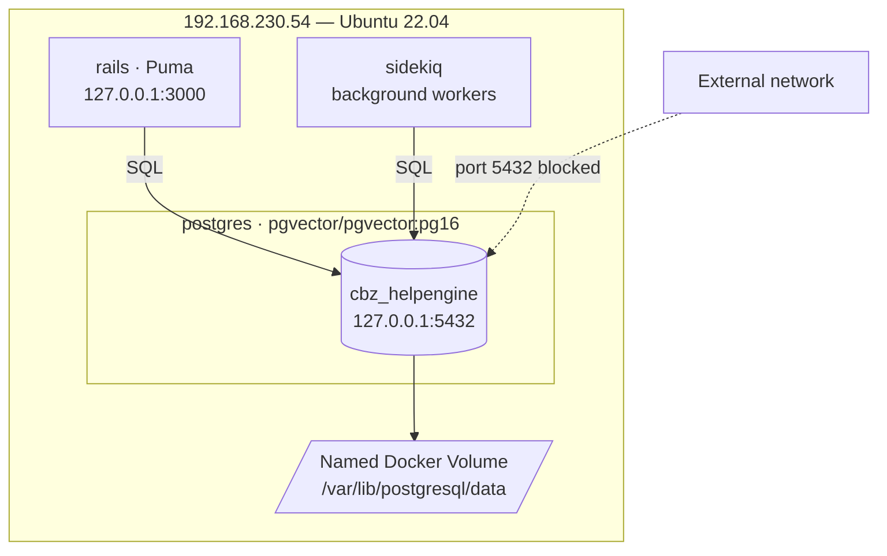

<p align="center">
  
</p>

<h1 align="center">CBZ HelpEngine</h1>
<p align="center"><strong>Database Architecture</strong></p>
<p align="center">Confidential &nbsp;·&nbsp; Infrastructure &nbsp;·&nbsp; CBZ IT Department</p>

---

## Overview

CBZ HelpEngine uses a single-instance PostgreSQL 16 database running inside a Docker container on the application server. All application data — conversations, contacts, agents, inboxes, messages, and configuration — is stored in this database. No external database services or cloud storage are used.

---

## Infrastructure

| Property | Value |
|---|---|
| Engine | PostgreSQL 16 |
| Docker image | `pgvector/pgvector:pg16` |
| Host server | Ubuntu 22.04 LTS — `192.168.230.54` |
| Bind address | `127.0.0.1:5432` (localhost only — not network-accessible) |
| Database name | `cbz_helpengine` |
| Superuser | `postgres` |
| Data volume | Named Docker volume — persists across container restarts |
| Environment | UAT / Staging |

---

## Architecture Diagram



Only the Rails application (Puma) and Sidekiq workers connect to the database. The port is not exposed outside `127.0.0.1` — external access requires an SSH tunnel.

---

## Authentication

| Property | Value |
|---|---|
| Auth method | Password — SCRAM-SHA-256 |
| Superuser account | `postgres` |
| Application connection | Via `DATABASE_URL` environment variable in `.env` |
| Network restriction | Connections accepted from `127.0.0.1` only |

No Windows Authentication, LDAP, or certificate-based auth is configured. The `postgres` superuser password is stored in `~/cbz-helpengine/.env` on the server as `POSTGRES_PASSWORD`.

---

## Extensions

| Extension | Purpose |
|---|---|
| `plpgsql` | PL/pgSQL procedural language (built-in) |
| `pgcrypto` | Cryptographic functions — used for token generation and encryption |
| `pg_trgm` | Trigram-based text similarity — powers fuzzy/full-text contact and conversation search |
| `pg_stat_statements` | Query performance statistics — used for monitoring slow queries |
| `vector` | pgvector — stores and queries AI embedding vectors for semantic search (Captain AI features) |

---

## Schema Overview

The database contains 85 tables. They are grouped by domain below.

### Core — Accounts & Users

| Table | Purpose |
|---|---|
| `accounts` | Tenant record — CBZ HelpEngine runs as a single account (ID: 1) |
| `users` | Agent and administrator records |
| `account_users` | Join table — links users to accounts with role (`agent`/`administrator`) and availability |
| `custom_roles` | Custom role definitions (Enterprise) |
| `installation_configs` | Key/value store for application-wide configuration (branding, feature flags) |

### Inboxes & Channels

| Table | Purpose |
|---|---|
| `inboxes` | Inbox records (WhatsApp, email, web widget, etc.) |
| `channel_whatsapp` | WhatsApp Cloud API channel config (phone number, API token, webhook) |
| `channel_email` | Email channel config |
| `channel_web_widgets` | Web chat widget config |
| `channel_facebook_pages` | Facebook Messenger config |
| `channel_api` | Generic API channel |
| `channel_instagram`, `channel_telegram`, `channel_sms`, `channel_twilio_sms`, `channel_tiktok`, `channel_twitter_profiles`, `channel_line` | Other supported channel types |
| `inbox_members` | Agents assigned to each inbox |
| `working_hours` | Business hours per inbox |

### Conversations & Messages

| Table | Purpose |
|---|---|
| `conversations` | One record per support conversation |
| `messages` | Individual messages within conversations (inbound and outbound) |
| `attachments` | File attachments linked to messages |
| `mentions` | Agent @-mentions within conversations |
| `conversation_participants` | Agents watching/following a conversation |
| `csat_survey_responses` | Customer satisfaction survey results |
| `calls` | Voice call records |

### Contacts

| Table | Purpose |
|---|---|
| `contacts` | Customer/contact records (name, phone, email) |
| `contact_inboxes` | Links a contact to a specific inbox (one per channel identity) |
| `companies` | Company records linked to contacts |
| `notes` | Agent notes on a contact |
| `tags` / `taggings` | Contact tagging |
| `data_imports` | Bulk contact import job records |

### Teams & Assignment

| Table | Purpose |
|---|---|
| `teams` | Team definitions |
| `team_members` | Agents in each team |
| `assignment_policies` | Rules for auto-assigning conversations |
| `inbox_assignment_policies` | Assignment policy per inbox |
| `agent_capacity_policies` | Max conversation load per agent |
| `inbox_capacity_limits` | Conversation limits per inbox |
| `applied_slas` | SLA policy applications to conversations |
| `sla_policies` | SLA policy definitions |
| `sla_events` | SLA breach/hit events |
| `leaves` | Agent leave/absence records |

### Automation & Configuration

| Table | Purpose |
|---|---|
| `automation_rules` | Trigger-condition-action automation rules |
| `macros` | One-click action sequences for agents |
| `canned_responses` | Pre-written message templates |
| `labels` | Conversation label definitions |
| `custom_attribute_definitions` | Custom fields for conversations and contacts |
| `custom_filters` | Saved conversation filter views per agent |
| `webhooks` | Outbound webhook endpoint registrations |
| `integrations_hooks` | Third-party integration configurations |
| `email_templates` | Transactional email templates |
| `notification_settings` | Per-agent notification preferences |
| `notifications` | Agent notification records |
| `notification_subscriptions` | Push notification device subscriptions |

### Captain AI (Enterprise)

| Table | Purpose |
|---|---|
| `captain_assistants` | AI assistant definitions |
| `captain_inboxes` | Assistants linked to inboxes |
| `captain_documents` | Knowledge base documents for AI |
| `captain_custom_tools` | Custom tool definitions for AI |
| `captain_scenarios` | AI conversation scenarios |
| `captain_assistant_responses` | AI-generated response records |
| `article_embeddings` | pgvector embeddings of knowledge base articles |
| `copilot_messages` / `copilot_threads` | Agent copilot conversation threads |

### Knowledge Base

| Table | Purpose |
|---|---|
| `portals` | Help centre portal definitions |
| `portals_members` | Agents with portal access |
| `articles` | Knowledge base articles |
| `categories` | Article categories |
| `related_categories` | Category relationships |
| `folders` | Article folder structure |

### Authentication & Access

| Table | Purpose |
|---|---|
| `access_tokens` | API access tokens per user |
| `account_saml_settings` | SAML SSO configuration per account |
| `agent_bots` | Agent bot definitions |
| `agent_bot_inboxes` | Bots linked to inboxes |
| `platform_apps` | Platform API application records |
| `platform_app_permissibles` | Platform app access grants |
| `platform_banners` | System-wide banner notifications |
| `dashboard_apps` | Embedded dashboard app definitions |

### Reporting

| Table | Purpose |
|---|---|
| `reporting_events` | Raw event records for reports |
| `reporting_events_rollups` | Pre-aggregated reporting data |
| `audits` | Audit log of agent actions |

### File Storage

| Table | Purpose |
|---|---|
| `active_storage_attachments` | Links between records and stored files |
| `active_storage_blobs` | File metadata (filename, size, checksum, content type) |
| `active_storage_variant_records` | Image variant (resize/crop) records |
| `action_mailbox_inbound_emails` | Raw inbound email records |

---

## Connection Pooling

Rails manages a connection pool configured via `DATABASE_URL` in `.env`. Default pool size is controlled by `RAILS_MAX_THREADS` (default: 5). Sidekiq maintains a separate pool. No external connection pooler (PgBouncer) is deployed.

---

## Backup

No automated backup is currently configured. The database is persisted in a named Docker volume (`cbz-helpengine_postgres_data`) on the server disk at `192.168.230.54`.

**Recommended:** Schedule a daily `pg_dump` to an off-server location:

```bash
docker exec cbz-helpengine-postgres-1 \
  pg_dump -U postgres cbz_helpengine | gzip > /backup/cbz_helpengine_$(date +%F).sql.gz
```

---

## Third-Party Integrations

The database has **no direct third-party integrations**. All external services connect through the Rails application layer:

| Service | Integration point |
|---|---|
| WhatsApp / Meta Cloud API | Rails controller → outbound HTTP — no direct DB access |
| CBZ UserConnect IAM | Rails service layer — no direct DB access |
| Microsoft Entra ID (SAML) | Via UserConnect — no direct DB access |
| SMTP mail relay (CBZ) | Rails ActionMailer — no direct DB access |
| Redis | Separate service — job queues and cache only, not a DB integration |

No BI tools, ETL pipelines, replication targets, or external query engines are connected to the database.

---

## Security Summary

| Control | Status |
|---|---|
| Network exposure | None — bound to `127.0.0.1` only |
| External port access | Blocked — requires SSH tunnel to reach |
| Authentication | Password (SCRAM-SHA-256) |
| Encryption at rest | Relies on host OS disk encryption (not configured at DB level) |
| Encryption in transit | Not applicable — connections are local (127.0.0.1) |
| Audit logging | `pg_stat_statements` enabled; application-level audit in `audits` table |
| Superuser access | `postgres` only — no separate read-only or application-scoped user |
