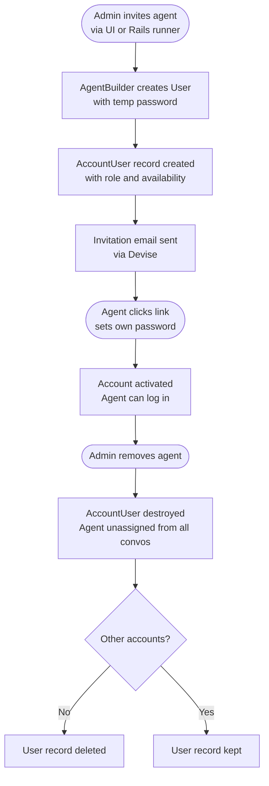

# CBZ HelpEngine — User Management

## Overview

CBZ HelpEngine uses an invitation-only model. Public self-registration is disabled
(`ENABLE_ACCOUNT_SIGNUP=false`). All agents must be invited by an administrator.

---

## Roles

There are two roles, stored per-account on the `account_users` join table (not on the user record itself):

| Role | What they can do |
|---|---|
| `agent` | Handle conversations, send messages, apply labels and macros |
| `administrator` | Everything an agent can do, plus manage settings, inboxes, teams, automation, and invite/remove agents |

A user's role is specific to an account — the same email address could be an agent in one account and an administrator in another.

---

## Inviting agents

### Via the UI

Settings → Agents → Invite Agent

Enter the agent's name, email address, and role. An invitation email is sent automatically.
The agent clicks the link in the email to set their own password and activate their account.

### Via Rails runner

```ruby
account = Account.first
admin   = account.account_users.find_by(role: :administrator)&.user

AgentBuilder.new(
  email:     'agent@cbz.co.zw',
  name:      'Jane Moyo',
  role:      :agent,            # or :administrator
  inviter:   admin,
  account:   account
).perform
```

The builder:
1. Looks up an existing `User` record by email — if found, links them to this account
2. If not found, creates a new user with a temporary random password
3. Creates an `AccountUser` record linking the user to the account with the specified role
4. Sends a Devise invitation email so the user can set their own password

### Bulk invite via the UI

Settings → Agents → Import — paste a list of email addresses. Each is invited as an
`agent` with the name defaulting to the email prefix. Useful for initial onboarding.

---

## Availability status

Each agent has an availability status tracked in real time:

| Status | Meaning |
|---|---|
| `online` | Active in the browser — can receive conversation assignments |
| `busy` | Logged in but unavailable for new assignments |
| `offline` | Not available |

Availability is stored in `account_users` and mirrored to Redis for live presence tracking.

### Auto-offline

When **Auto Offline** is enabled (`auto_offline: true`, the default), the agent is
automatically set to `offline` when they close all browser tabs. When they return,
they are set back to `online`.

Agents can toggle their own availability from the avatar menu in the bottom-left corner.
Administrators can set availability when creating or editing an agent.

---

## Updating an agent

### Via the UI

Settings → Agents → click the edit icon next to the agent.

You can update:
- **Name** — display name shown in conversations
- **Role** — promote to administrator or demote to agent
- **Availability** — override their current status
- **Auto Offline** — toggle automatic offline on browser close

### Via Rails runner

```ruby
account = Account.first
user    = User.find_by(email: 'agent@cbz.co.zw')
au      = account.account_users.find_by(user: user)

# Change role
au.update!(role: :administrator)

# Change availability
au.update!(availability: :busy)

# Disable auto-offline
au.update!(auto_offline: false)
```

---

## Removing an agent

### Via the UI

Settings → Agents → click the delete icon. The agent is removed from the account.
If they have no other accounts, their user record is deleted asynchronously.

### Via Rails runner

```ruby
account = Account.first
user    = User.find_by(email: 'agent@cbz.co.zw')
account.account_users.find_by(user: user).destroy!
```

Removing an agent:
- Unassigns them from all open conversations (conversations remain open, unassigned)
- Removes them from all teams and inboxes within this account
- Sends an `AGENT_REMOVED` event for any webhooks subscribed to it

---

## Teams

Teams group agents for routing and reporting. A conversation can be assigned to a team,
and automation rules can route conversations to specific teams.

### Creating a team

**Via the UI:** Settings → Teams → Create New Team

**Via Rails runner:**

```ruby
account = Account.first
team = account.teams.create!(
  name:              'Card Services',
  description:       'Handles debit and credit card queries',
  allow_auto_assign: true
)
```

`allow_auto_assign: true` enables the round-robin auto-assignment feature for that team.

### Adding agents to a team

**Via the UI:** Settings → Teams → (team) → Settings → Add Agents

**Via Rails runner:**

```ruby
account = Account.first
team    = account.teams.find_by(name: 'Card Services')
users   = account.users.where(email: ['agent1@cbz.co.zw', 'agent2@cbz.co.zw'])

team.add_members(users.pluck(:id))
```

### Removing agents from a team

```ruby
team.remove_members(users.pluck(:id))
```

---

## Inbox assignment

Agents must be assigned to an inbox to appear as assignment options for conversations
in that inbox. Unassigned agents can still be manually assigned by an administrator.

### Assigning agents to an inbox

**Via the UI:** Settings → Inboxes → (inbox) → Collaborators → Add Agents

**Via Rails runner:**

```ruby
account = Account.first
inbox   = account.inboxes.find_by(name: 'WhatsApp Support')
users   = account.users.where(email: ['agent1@cbz.co.zw', 'agent2@cbz.co.zw'])

inbox.add_members(users.pluck(:id))
```

### Removing agents from an inbox

```ruby
inbox.remove_members(users.pluck(:id))
```

---

## Notification settings

When an agent is added to the account, default notification settings are created automatically:

| Notification | Default |
|---|---|
| Email — conversation assigned to me | Enabled |
| Push — conversation assigned to me | Enabled |
| All other notifications | Disabled |

Agents can adjust their own notifications from Settings → Notifications.

---

## User lifecycle flow



---

## Planned: SSO / Directory Integration

> **TODO** — Neither of these integrations is implemented yet. They are tracked here
> as the intended next step for simplifying agent onboarding and offboarding at CBZ.

### Microsoft Active Directory (Azure AD / Entra ID)

Integrating with CBZ's existing Active Directory would allow:

- Agents to log in with their standard CBZ Windows credentials (no separate password)
- Automatic account deactivation when an employee leaves (AD account disabled → HelpEngine access revoked)
- Role mapping from AD groups (e.g. `HelpEngine-Admins` → `administrator`, `HelpEngine-Agents` → `agent`)

Chatwoot supports SAML 2.0 and OAuth 2.0 / OpenID Connect out of the box (Enterprise).
Azure AD can act as the Identity Provider (IdP) over either protocol.

**What needs to be done:**

1. Register CBZ HelpEngine as an Enterprise Application in Azure AD (IT/Azure admin)
2. Configure SAML or OIDC credentials in `.env` (`SSO_*` variables)
3. Map AD group membership to HelpEngine roles via attribute claims
4. Test with a pilot group before rolling out to all agents

### UserConnect (CBZ Internal IdP)

If CBZ operates an internal identity provider (UserConnect), the same SAML/OIDC
approach applies — HelpEngine registers as a Service Provider (SP), UserConnect acts
as the IdP.

**What needs to be done:**

1. Obtain the UserConnect IdP metadata URL and signing certificate from IT
2. Register HelpEngine's SP metadata with UserConnect
3. Configure `SSO_ENABLED`, `SSO_IDP_*` variables in `.env`
4. Map UserConnect attributes (`email`, `displayName`, group claims) to HelpEngine fields

### Benefits once implemented

- Agents use one set of credentials across all CBZ systems
- Offboarding is automatic — disabling the AD/UserConnect account immediately revokes HelpEngine access
- No need for administrators to manually invite or remove agents for staff changes

---

## Summary — Where to find each setting

| Task | UI Path |
|---|---|
| Invite an agent | Settings → Agents → Invite Agent |
| Change role / availability | Settings → Agents → edit icon |
| Remove an agent | Settings → Agents → delete icon |
| Create a team | Settings → Teams → Create New Team |
| Add agents to a team | Settings → Teams → (team) → Settings |
| Assign agents to an inbox | Settings → Inboxes → (inbox) → Collaborators |
| Agent notification preferences | Settings → Notifications |
| Agent profile (name, avatar, password) | Settings → Profile |
